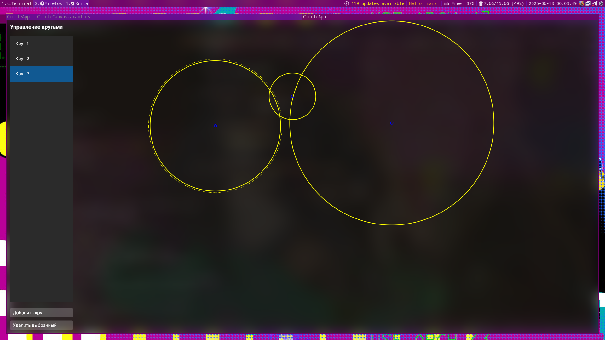

# CircleApp - Avalonia UI Geometric Figures Editor


[](https://dotnet.microsoft.com/)


CircleApp is a desktop application built with Avalonia UI that allows users to create, manipulate, and manage geometric circle figures on a canvas. The application features a sleek dark Fluent design with acrylic blur effects and full window transparency.



## Features

- 🎨 **Beautiful UI**: Dark Fluent theme with acrylic blur transparency effects
- ⭕ **Circle Creation**: Create multiple circles with random sizes and colors
- 🖱️ **Interactive Manipulation**:
  - Move circles by dragging their center
  - Resize circles by dragging their boundary
- 📋 **Circle Management**:
  - List all circles with unique identifiers
  - Select circles from list or canvas
  - Delete individual circles
- 🚀 **Modern Architecture**:
  - MVVM pattern with ReactiveUI
  - Avalonia's native rendering engine
  - .NET 8 compatibility

## Requirements

- [.NET 8 SDK](https://dotnet.microsoft.com/download/dotnet/8.0)
- Avalonia UI development environment

## Installation & Running

1. Clone the repository:
```bash
git clone https://github.com/yourusername/CircleApp.git
cd CircleApp

2. Restore dependencies:
```bash
dotnet restore

3. Run the application:
```bash
dotnet run

## Usage Guide
**Creating Circles**

-  Click the "Добавить круг" (Add Circle) button

-  A new circle with random size and color will appear on the canvas

**Manipulating Circles**

-  Move a circle: Click and drag the center point of a circle

-  Resize a circle: Click and drag the boundary of a circle

-  Select a circle: Click on a circle to select it

**Managing Circles**

-  View all circles: The left panel shows a list of all circles

-  Delete a circle:

-  Select a circle and click "Удалить выбранный" (Delete Selected)

-  Right-click a circle in the list and select "Удалить" (Delete)

**Window Management**

-  Move window: Drag the top panel of the application

-  Close window: Use the standard window close button

## Technical Details
**Project Structure**


